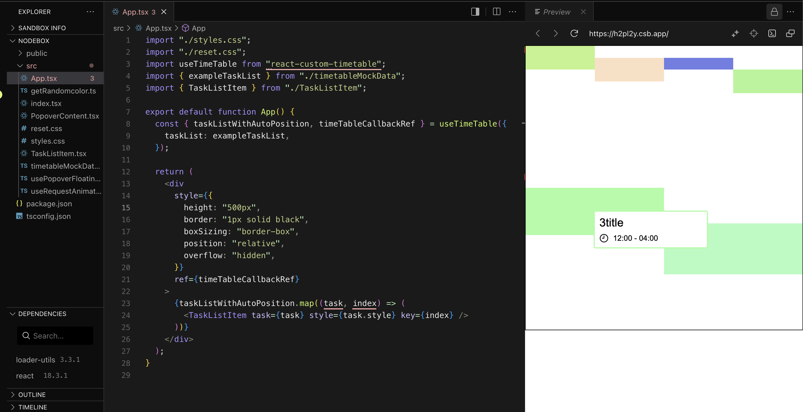
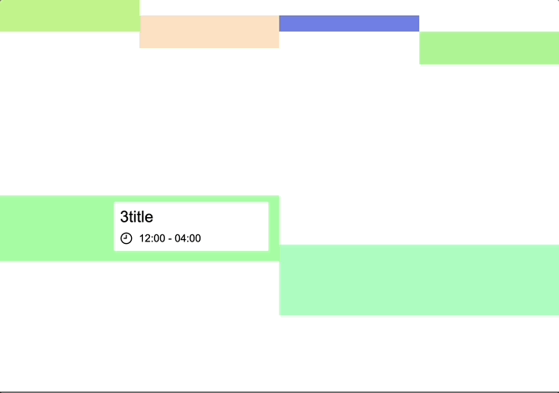

# react-custom-timetable ⏰

React timetable Component.

The **headless component method** allows developers to wear the design they want.  
In addition, if the time of the elements inside the time table overlaps, it can be rendered appropriately through internal logic.

[](https://www.npmjs.com/package/react-custom-timetable)

## Example

[sandbox link](https://codesandbox.io/p/sandbox/react-custom-timetable-h2pl2y?file=%2Fsrc%2FApp.tsx%3A24%2C68)



## Screenshots



## Getting started :

install

```bash
npm i react-custom-timetable
```

## Usage

```typescript
import "./styles.css";
import "./reset.css";
import useTimeTable from "react-custom-timetable";
import { exampleTaskList } from "./timetableMockData";
import { TaskListItem } from "./TaskListItem";

function App() {
   const { taskListWithAutoPosition, timeTableCallbackRef } = useTimeTable({
    taskList: exampleTaskList,
  });

  return (
    <div
      style={{
        height: "500px",
        border: "1px solid black",
        boxSizing: "border-box",
        position: "relative",
        overflow: "hidden",
      }}
      ref={timeTableCallbackRef}
    >
      {taskListWithAutoPosition.map((task, index) => (
        <TaskListItem task={task} style={task.style} key={index} />
      ))}
    </div>
  );
}
```

## API Reference

#### `useTimeTable(options)`

**Options:**

| Parameter  | Type                 | Description                 |
| :--------- | :------------------- | :-------------------------- |
| `taskList` | `UseTimeTableOption` | **Required**. Your TaskList |

```typescript
export interface BaseTask {
  id: number | string;
  startTime: Date;
  endTime: Date;
}

type UseTimeTableOption<T extends BaseTask> = {
  taskList: T[];
  startTime?: Date;
  endTime?: Date;
  title?: string;
};
```

**Return Values:**

- `taskListWithAutoPosition` : An automatically sorted task list with size and location attributes additionally according to the start and end times of the to-do

  - Contains the `style properties` added to each Task object.

- `timeTableCallbackRef` : `Ref` to be connected to the DOM element.
  - This must be the same div tag as the size of the timable. Use the div tag to specify the size of the to-do.
